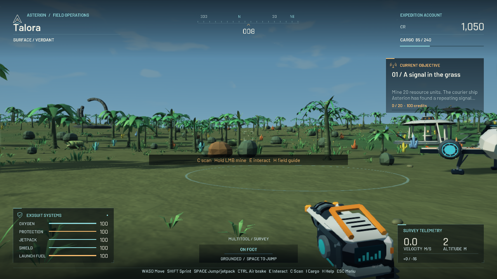

# Asterion Expedition

**Follow a quiet signal. Leave a brighter map.** · Version 1.4.0

An original, native, single-player 3D space-exploration game: survey alien life,
mine materials, fabricate equipment, fly between worlds, trade at orbital
exchanges, and establish a field base while uncovering the Meridian network.
The Asterion Reach contains **24 systems, 96 planets, 8 biomes, and an 18-stage
expedition story**.



This download is a **complete source ZIP**, with original generated geometry,
audio, game code, and launch scripts. It opens a desktop game window through
Panda3D. It requires **64-bit Python 3.10–3.14** and a first-run dependency
download. A prebuilt or signed `.app`/`.exe` is not included.

## Celestial graphics edition

Version 1.4 rebuilds the presentation throughout the expedition: warm directional
lighting and soft shadows, finely shaded terrain, reflective animated water,
layered clouds and atmospheric limbs, a stellar dust lane, and a cleaner image
with selective bloom and edge smoothing. Plants have curved leaves, varied
crowns and gentle wind. Minerals, wildlife, ships, outposts, ruins, buildings
and stations have richer shapes and material detail.

The survey tool and cockpit now have bevelled metal, optical details and
engraved instruments. Extraction has a luminous beam and contact sparks;
scanning sends a survey wave across the clearing. The redesigned title, HUD
and field terminal use bundled Barlow and Rajdhani typography, restrained
colour, destination illustrations and clearer controls.

The complete seamless planets, their terrain collision, exploration systems
and existing saves are retained. The game still runs natively in Panda3D and
stays offline after installation. Hardware effects use OpenGL 3.2 or newer;
`--software` retains the improved geometry, interface, textures and baked
lighting when a hardware renderer is unavailable.

The title screen and window title show **v1.4.0 / CELESTIAL**. Close an older
running copy before launching this build. Check with `python3 main.py --version`.
To update from an older ZIP, extract this edition into a new folder and choose
**Continue**. Saves live separately from the game folder.

Actual game captures and verification are in
[the graphics validation folder](docs/validation-v1.4/) and
[the test report](docs/TEST_REPORT.md). The expanded planets and continuous
flight introduced in 1.3 remain documented in [the changelog](docs/CHANGELOG.md).

## Start on a Mac

1. Extract the entire ZIP. Keep all the files together in a writable folder,
   such as Downloads or Documents.
2. Install a supported Python from [python.org](https://www.python.org/downloads/)
   if you do not already have Python 3.10–3.14. The installer should match your
   Mac; the regular macOS universal installer works on Intel and Apple Silicon.
3. Open the extracted folder and double-click **Start-Mac.command**. A Terminal
   window runs setup and then opens the game.
4. Choose **New Expedition**. Press **H** any time during play for controls.

If Finder reports a permissions problem, use Terminal. Type `cd `, drag the
extracted game folder into the Terminal window, and press Return. Then run:

```sh
python3 bootstrap.py
```

You can also run `bash Start-Mac.command` from that folder. These commands do not
require administrator access. Leave the Terminal window open while playing;
it displays a useful error message if launch fails.

On the first run, the launcher creates a private `.venv` folder and installs
**Panda3D 1.10.16** from the official Python Package Index. This can take a few
minutes, depending on your connection. Once that version is installed, later
launches reuse it without contacting the network. The game itself is offline.
Moving the extracted game folder after setup can invalidate the virtual
environment; see the troubleshooting notes below.

## Windows and Linux

| Platform | Launch | If the script does not open |
| --- | --- | --- |
| Windows | Double-click `Start-Windows.bat` | In a terminal in the game folder: `py -3 bootstrap.py` |
| Linux | Run `sh Start-Linux.sh` in a terminal | `python3 bootstrap.py`; your Python installation needs the `venv` module |

Use 64-bit CPython 3.10–3.14. Desktop graphics support is required. A keyboard and
mouse or trackpad are required; a mouse is easiest for flight and mining. The
interface is designed for a 1280 × 720 or larger window.

## Your first expedition

Start beside your courier ship on Talora, a gentle emerald world. Walk toward a
mineral deposit or plant, aim at it, and **hold left mouse** until extraction
finishes. Press **C** to survey nearby life and minerals. Open **K** and craft a
Launch Cell from carbon and ferrite. The objective card and **J** journal guide
you through the opening chapters.

Approach your ship and press **E** or **F** to launch. **W** gives thrust, the
mouse steers, and **Space** climbs. Hold **Shift** to boost through the clouds
and thinning air into space. Atmospheric effects fade out around 2.2 km above
the terrain. Point toward any planet and fly into its atmosphere to descend.
Below **65 m** and **48 m/s**, press **F** to land. Open **M** for an automatic
approach that physically climbs, cruises and descends to the survey district.
**E** cancels it. A station approach opens its exchange.

Keep oxygen, sodium, and cells in cargo. **R** uses a suitable recharge item;
**I** opens cargo for individual item actions. Ships and outposts provide
shelter. **X** recalls your ship on the surface. If you run out of supplies,
the **Esc** menu has a rescue option so your expedition can continue.

Read [the field guide](docs/FIELD_GUIDE.md) for a complete opening route,
flight procedures, progression advice, and saving. The
[content reference](docs/REFERENCE.md) lists every material, recipe, building,
and biome.

## Controls

| Input | On foot | In flight / orbit |
| --- | --- | --- |
| Mouse or arrow keys | Look and aim | Steer |
| W / S | Walk forward / backward | Thrust / brake and reverse |
| A / D | Walk left / right | Strafe |
| Shift | Sprint | Boost |
| Space | Jump; hold for jetpack | Ascend |
| Ctrl | Air brake; with Space, hover | Descend |
| Hold left mouse | Mine plants and mineral deposits | Mine asteroids in orbit |
| E | Interact; launch near your ship | Dock near a station; cancel automatic approach |
| F | Launch near your ship | Land below 65 m and 48 m/s |
| C | Survey scan | Survey scan |
| R | Quick recharge | Quick recharge / refuel |
| X | Recall ship nearby | — |
| I or Tab | Cargo | Cargo |
| K | Fabricator and upgrades | Fabricator and upgrades |
| M | Navigation | System and interstellar navigation |
| J | Journal and contracts | Journal and contracts |
| B | Construction | Construction panel |
| H | Help | Help |
| Esc | Pause, settings, rescue, and return | Pause, settings, rescue, and return |
| F5 | Save | Save |
| F9 | Open reload confirmation | Open reload confirmation |

On some Mac keyboards, hold **Fn** to send F5 or F9. Menus release the pointer
and pause survival. Click their buttons and scroll longer lists. Close a panel
with **Esc** or the same shortcut you used to open it.

## Saving

One local expedition slot is saved automatically during play, on planet
arrival, and when you quit normally. **F5** saves immediately. Save files include
cargo, upgrades, discoveries, depleted deposits, construction, progression,
settings, your location, and flight velocity/orientation. An atmospheric flight
save resumes in the air at the same place with the same momentum. Orbital saves
resume in space. Old saves are upgraded once to the expanded chart. The original pre-1.3 file is also retained beside the rolling backup.

| Platform | Save directory |
| --- | --- |
| macOS | `~/Library/Application Support/AsterionExpedition/` |
| Windows | `%LOCALAPPDATA%\AsterionExpedition\` |
| Linux | `$XDG_DATA_HOME/asterion-expedition/`, or `~/.local/share/asterion-expedition/` when that variable is unset |

The main file is `expedition.json`. The save system keeps a backup and uses
atomic replacement. Close the game before making your own copy of the save
folder. Save data is separate from the game installation and `.venv`.

## Troubleshooting

| What happens | What to try |
| --- | --- |
| Python is missing or too old | Install CPython 3.10–3.14. On macOS, the older Apple-provided Python may not be suitable. |
| `main.py is missing` | Extract the entire ZIP; do not run a script from inside the archive. |
| Setup cannot create `.venv` | Move the extracted game into a writable folder. On Linux, install the distribution's `python3-venv` package for your Python version. |
| Pip cannot download Panda3D | Read the Terminal message, restore the internet connection, and retry. The first-run installer only accepts the pinned binary package. |
| You moved the game or upgraded Python | Close the game, rename `.venv` to `.venv-old`, and launch again. This recreates dependencies; it does not delete saves. |
| The game window will not open | Run from Terminal to see the error. Try `python3 bootstrap.py --software --no-audio` as a diagnostic; software rendering is slower and visually limited. |
| Sound crackles or hardware is unavailable | Launch with `python3 bootstrap.py --no-audio`, or lower sound volume in Settings. |
| Mouse keeps moving the camera while you need the desktop | Press Esc to pause and release the pointer. |
| You cannot mine | Move closer, keep the target under the reticle, hold the button, and check free cargo space. Solid objects now block the beam. Surface-flight mining is unavailable. |
| You cannot land | Fly through the atmosphere, descend below 65 m and brake below 48 m/s, then press F over open ground. M can fly an automatic approach. |
| You cannot launch | Move within reach of the ship, press R to recharge fuel, or use rescue from Esc. X recalls the ship on foot. |

If an application error occurs after startup, details may also be written to
`crash.log` beside the save file. See [technical notes](docs/TECHNICAL_NOTES.md)
for diagnostic commands and implementation details.

## Scope and current limits

This is an original compact exploration game with a stylized visual style and
a finite, reproducible universe. It is not a commercial game's source, an exact
remake, or a claim of feature parity. Planets are stylized physical spheres with
streamed detail; terrain has no caves or overhangs, and water supports ships and surface movement
without swimming or underwater gameplay. Interstellar folds still use a short
transition. Fauna, weather, station trading, and base production use lightweight
simulations. Buildings are fixed prefab structures. There is no multiplayer,
combat campaign, freighter fleet, vehicle collection, voice acting, or controller
support.

This update is checked on macOS using Panda3D hardware and software offscreen rendering and actual
application descents, plus automated gameplay and save regressions. These checks cannot establish a desktop frame-rate guarantee, hardware-audio
compatibility, or every display/driver combination. The source and launchers are
provided so the project can be inspected, run, and extended.

See the [validation report](docs/TEST_REPORT.md) for the automated suite, corrected
issues, and limits of the checks.

Original code and generated assets are under the [MIT license](LICENSE).
Bundled DejaVu fonts and the installed Panda3D runtime have separate terms;
see [third-party notices](THIRD_PARTY_NOTICES.md).
