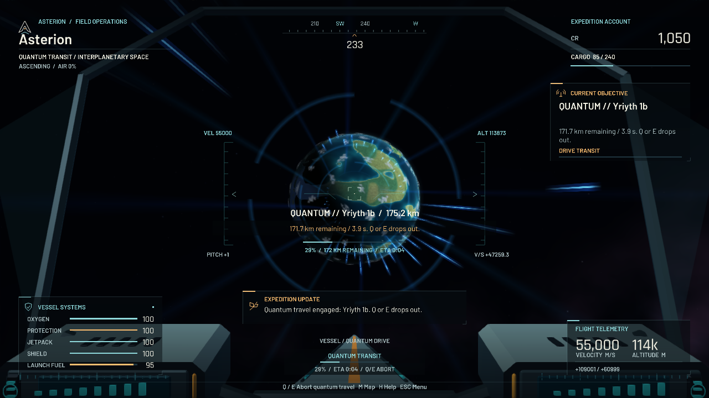

# Quantum drive validation

The ship now has a separate interplanetary quantum drive: select **QUANTUM
TARGET** in M, climb above 3 km, press Q to spool and align, then press Q at
READY to engage. Q or E cancels transit. Arrival stops 3.5 km above the target;
ordinary boost and automatic landing remain available.

## Verification

All **326 tests** pass across the main regression run (316 tests) and the ten
supplemental checks added during final integration. See
[regression-report.json](regression-report.json) and
[supplemental-report.json](supplemental-report.json).

The new coverage checks deterministic motion and every crossed route segment,
fuel charged only on engagement, spooling and cooldown, real chart and keyboard
controls, Shift/Ctrl combinations, pause/resume, unexpected collision dropout,
safe save/reload, reset behavior, mutually exclusive travel controls, HUD
bounds, retained effect geometry, and motion/accessibility settings.

Actual application journeys were rendered with native OpenGL at 1280 × 720 and
960 × 540, and Panda3D software rendering at 1280 × 720. The measured route was
240,415 metres, with 5.87 seconds in transit, 5.40 fuel consumed, and arrival
3,500.01 metres above the surface. Each journey uses temporary saves and checks
arrival, fuel, stopped velocity, and destination identity. These are offscreen
functional and visual checks, not a desktop frame-rate or hardware-audio test.



## Reproduce

Run from the repository root using the installed virtual environment:

```sh
PYTHONDONTWRITEBYTECODE=1 .venv/bin/python tools/run_regressions.py --workers 3 --output /tmp/asterion-regressions.json
PYTHONDONTWRITEBYTECODE=1 .venv/bin/python tools/validate_quantum.py --renderer gl --size 1280 720
PYTHONDONTWRITEBYTECODE=1 .venv/bin/python tools/validate_quantum.py --renderer gl --size 960 540
PYTHONDONTWRITEBYTECODE=1 .venv/bin/python tools/validate_quantum.py --renderer tiny --size 1280 720
```

The regression runner discovers all current tests, including those recorded
separately in the supplemental report. Visual captures cover the navigation
chart, spooling, readiness, transit, and arrival for each renderer/size.
