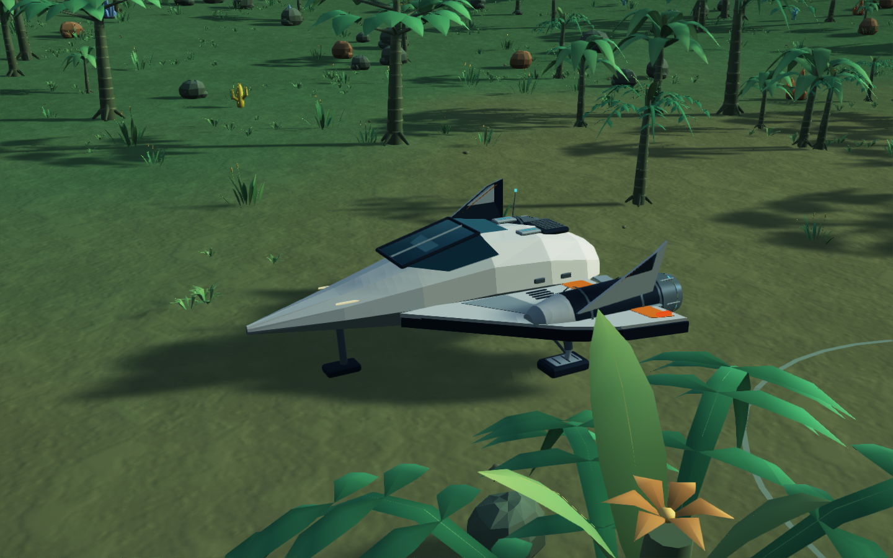
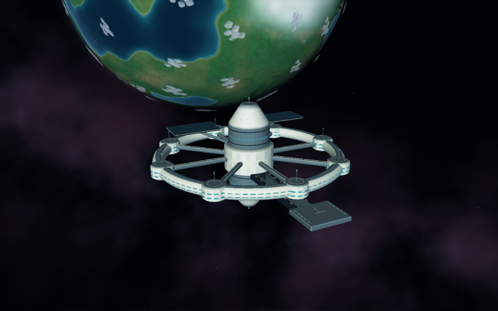
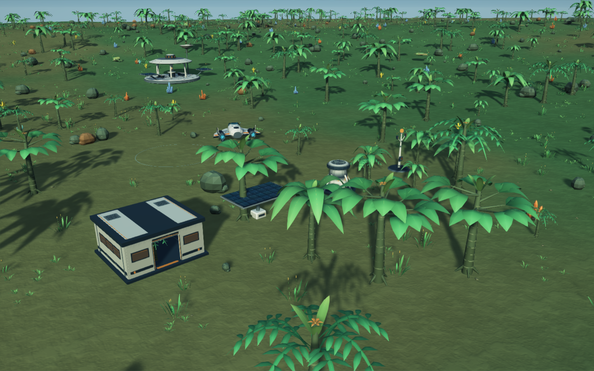
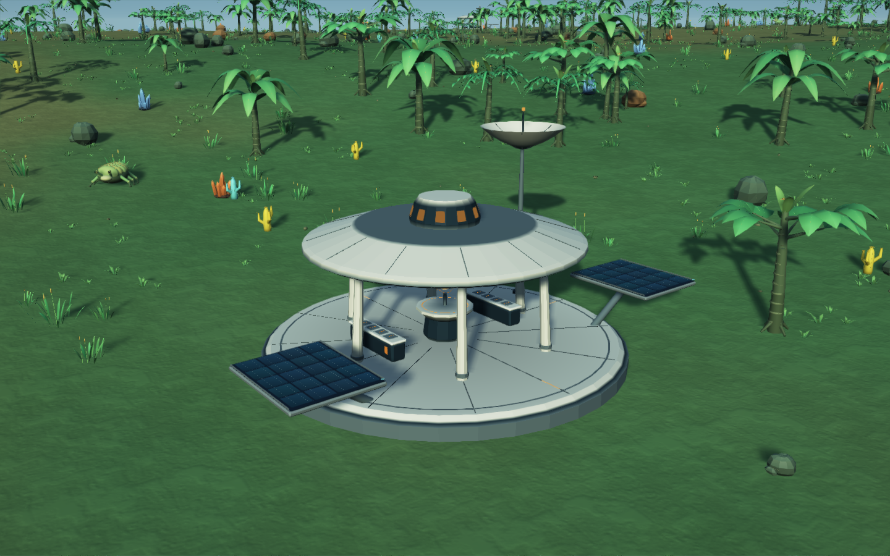
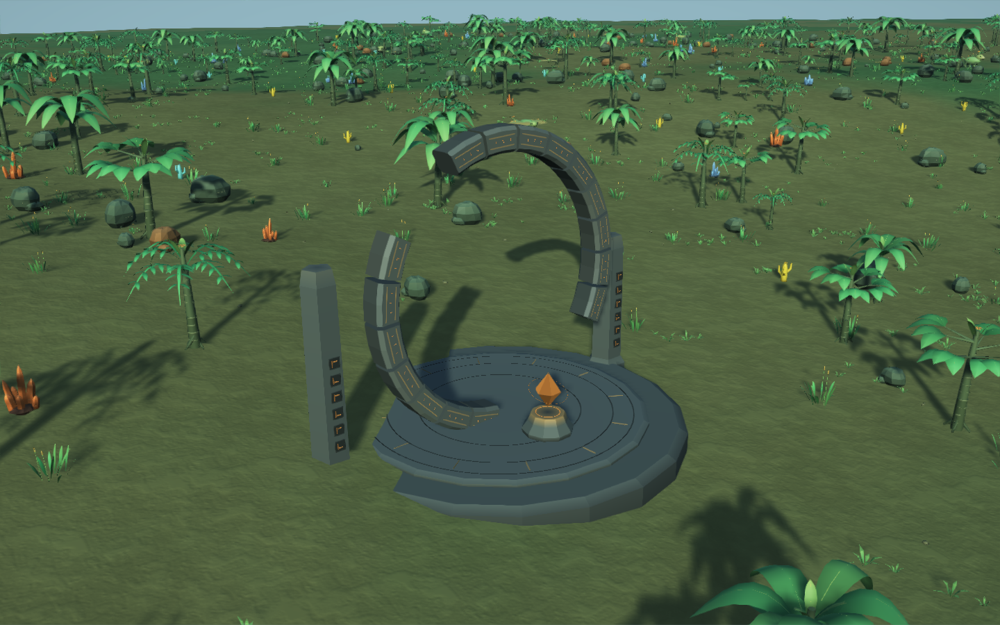
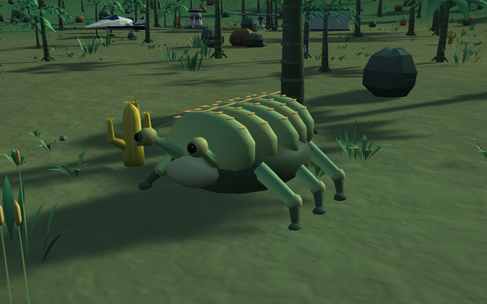
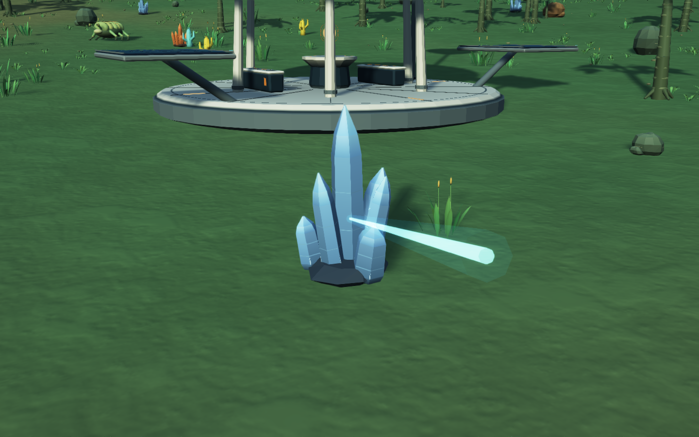
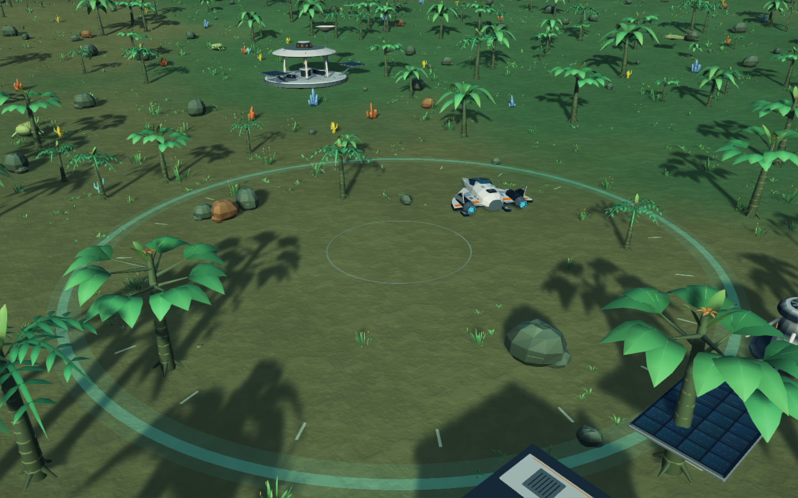

# Celestial art details

Production game assets, rendered at 1440 × 900 with the native OpenGL pipeline.
These inspection views use a disposable expedition and deliberately positioned
cameras. Models, lighting and effects are unchanged from gameplay.

